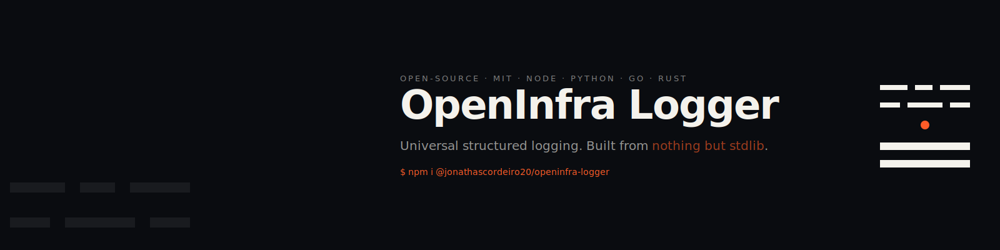

<p align="center">
  
</p>

# OpenInfra Logger


**OpenInfra Logger** (OIL) is a robust, structured logging and observability library for **Node.js, Python, Go and Rust**. It is built from each runtime's standard library — **zero external dependencies** — and ships the same JSON shape across every language so polyglot stacks see a single, consistent log format.

## Why OIL

In modern distributed systems, structured logs are foundational infrastructure. Fragmented log formats across services make Datadog/Elastic queries unreliable and incident response slow. OpenInfra Logger addresses that fragmentation with:

- **Consistent observability** — one structured JSON shape across Node, Python, Go and Rust
- **No third-party packages** — every implementation is built from its language's standard library. Your `node_modules` / `site-packages` / `target/` stays clean and your supply-chain surface is the library itself.
- **Native batching** — buffered remote transport (Node / Python), ~100× fewer egress requests than log-per-call
- **Auto-redaction** — `password`, `token`, `secret`, `api_key`, `credit_card` replaced with `[REDACTED]` before they touch the wire (LGPD/GDPR-friendly, recursive, case-insensitive)
- **OpenTelemetry-aware** — `trace_id` and `span_id` are picked up automatically when a span is active (Node / Python)
- **Datadog & Elastic (ECS) formatters** — switch the wire payload with a single config line

## Installation

### Node.js

```bash
npm install @jonathascordeiro20/openinfra-logger
```

### Python

```bash
# Clone the repo (no PyPI package yet) and use the package directly:
pip install -e ./python
```

### Go

```bash
go get github.com/jonathascordeiro20/openinfra-logger/go
```

### Rust

```toml
# Cargo.toml
[dependencies]
openinfra_logger = { git = "https://github.com/jonathascordeiro20/openinfra-logger" }
```

## Usage

### Basic console logging (Node)

```javascript
const { log } = require('@jonathascordeiro20/openinfra-logger');

log('System initialized successfully', 'info');
log('Failed to parse incoming payload', 'error', { requestId: '123' });
```

### Advanced configuration — file + remote with batching

```javascript
const { log, configure } = require('@jonathascordeiro20/openinfra-logger');

configure({
  transports: ['console', 'file', 'remote'],
  filePath: './production.log',
  remoteUrl: 'https://logs.my-infrastructure.com/ingest',
  defaultMetadata: { service: 'payment-gateway', env: 'production' }
});

log('Payment processed', 'info', { transactionId: 'abc-456' });
```

See `examples/` for [Express integration](examples/express-integration.js), [security logging](examples/security-logging.js) and more. Full options in [docs/advanced-configuration.md](docs/advanced-configuration.md).

### OpenTelemetry tracing

OIL detects an active OTel span and injects `trace_id` / `span_id` automatically, with no extra configuration.

```javascript
const { trace } = require('@opentelemetry/api');
const { log } = require('@jonathascordeiro20/openinfra-logger');

const tracer = trace.getTracer('demo');
tracer.startActiveSpan('auth-request', (span) => {
  // Output JSON will contain "trace_id" and "span_id"
  log('User successfully authenticated');
  span.end();
});
```

### Ecosystem formatters — Datadog & Elastic

```javascript
const { configure } = require('@jonathascordeiro20/openinfra-logger');

// Datadog: renames `level` → `status`, `trace_id` → `dd.trace_id`
configure({ formatter: 'datadog' });

// Elastic ECS: renames `timestamp` → `@timestamp`, `level` → `log.level`
// configure({ formatter: 'elastic' });
```

### Auto-redaction (LGPD / GDPR)

Sensitive keys are intercepted recursively before the entry is dispatched to any transport. The default list is `password`, `token`, `secret`, `api_key`, `credit_card` and can be overridden via `redactKeys` in `configure({...})`.

## Log analyzer — local-first, LLM opt-in

OIL ships a CLI that runs **fully on your machine** by default. No network call. It produces seven layered analyses:

1. **Clusters** — normalized message shapes ranked by frequency
2. **Heuristics** — six built-in patterns (timeout cascades, OOM, DB failures, 5xx, rate-limit, auth)
3. **Stack-trace dedup** — top-3 frames, line numbers and node_modules normalized
4. **Temporal cascades** — bursts of ≥3 errors within 1 s, with service breakdown
5. **Anomaly windows** — per-minute z-score over the baseline error rate
6. **Service-interaction graph** — derived from `trace_id` co-occurrence
7. **Service breakdown** + observed time window

```bash
npm run analyze app.log
```

For an LLM-deepened narrative (root cause in prose + suggested fix), opt in to one of three providers:

```bash
npm run analyze app.log -- --llm=anthropic   # cloud, needs ANTHROPIC_API_KEY
npm run analyze app.log -- --llm=ollama      # local LLM via Ollama (localhost:11434)
npm run analyze app.log -- --llm=openai      # OpenAI-compatible endpoint (LM Studio, vLLM, OpenAI)
npm run analyze app.log -- --prompt-only     # print the prompt, no API call
```

Your log lines stay on your machine unless you explicitly choose `--llm=anthropic` or `--llm=openai` (which send to the cloud). The `--llm=ollama` path keeps everything local.

## Documentation

Full manual in [`docs/manual/`](docs/manual/README.md) — 14 chapters covering concepts, configuration, every transport and formatter, redaction internals, OpenTelemetry, the analyzer CLI, performance, migration from Pino/Winston/structlog/zap, troubleshooting, FAQ, and a complete API reference per runtime.

5-minute quickstarts per runtime: [Node](docs/quickstart-node.md) · [Python](docs/quickstart-python.md) · [Go](docs/quickstart-go.md) · [Rust](docs/quickstart-rust.md).

## Testing

The repo includes a comprehensive test matrix — **69 tests across all four runtimes**:

```bash
npm test                                       # Node      · 32 tests
python -m unittest discover -s python/tests    # Python    · 22 tests
( cd go && go test ./... )                     # Go        ·  8 tests
( cd rust && cargo test )                      # Rust      ·  7 tests
```

Coverage spans redaction (top-level, nested, arrays, case-insensitive), log levels, transports (concurrency, burst writes, JSON escaping for quotes/newlines/unicode), batching (size + timer triggers, endpoint failure), and the Datadog/Elastic/default formatters.

## Roadmap

- [x] Node.js core (console, file, remote transports)
- [x] Native OpenTelemetry tracing integration
- [x] Python implementation
- [x] Go implementation
- [x] Rust implementation
- [x] Datadog and Elastic (ECS) formatters
- [x] Auto-redaction (LGPD/GDPR)
- [x] Native remote batching
- [x] AI-powered log analysis (Anthropic Claude)

## Contributing

Pull requests are welcome. Please read [CONTRIBUTING.md](CONTRIBUTING.md) and the [Code of Conduct](CODE_OF_CONDUCT.md) before submitting. The cross-language parity principle is important: a new core feature should be considered for all four runtimes.

## License

Released under the [MIT License](LICENSE).
